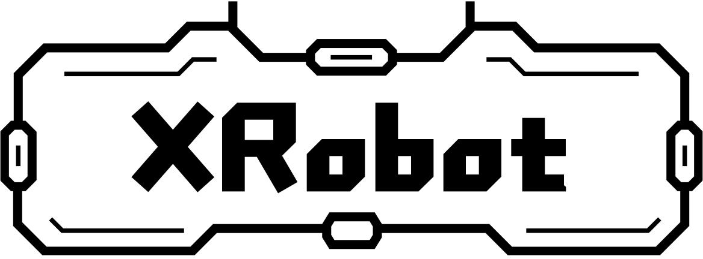

# libxr

Standardized compatibility layer for operating systems and peripheral devices written in C++. No function will be compiled into the firmware before it is called by the user.

  

## Who is this library for

* People who do not require desktop and web applications.
* Realtime and high performance.
* Finish the entire project quickly and reliably.
* Don't want to care about the differences in APIs.

## Support

## System Layer

1. The application will never exit unless it reboot or enter into low-power mode.
2. All memory is only allocated during initializtion and will never be released.
3. The minimum Non-blocking delay is 1us, minimum blocking delay is 1ms.
4. All unused functions will not be linked.

| `System`      | Thread | Timer | Semaphore | Mutex | Signal | ConditionVar | Queue | ASync |
| ------------- | ------ | ----- | --------- | ----- | ------ | ------------ | ----- | ----- |
| None          | ✅      | ✅     | ✅         | ✅     | ✅      | ✅            | ✅     | ✅     |
| FreeRTOS      | ✅      | ✅     | ✅         | ✅     | ✅      | ✅            | ✅     | ✅     |
| RT-Thread     | ❌      | ❌     | ❌         | ❌     | ❌      | ❌            | ❌     | ❌     |
| ThreadX       | ❌      | ❌     | ❌         | ❌     | ❌      | ❌            | ❌     | ❌     |
| PX5           | ❌      | ❌     | ❌         | ❌     | ❌      | ❌            | ❌     | ❌     |
| Linux         | ✅      | ✅     | ✅         | ✅     | ✅      | ✅            | ✅     | ✅     |
| Webots(Linux) | ✅      | ✅     | ✅         | ✅     | ✅      | ✅            | ✅     | ✅     |

## Data structure

1. Except list and tree, the memory of other data structures are determined before construction.
2. No blocking APIs except Queue. If you want one, use Semaphore.

| `Structure` | List | Stack | RBTree | LockFreeQueue |
| ----------- | ---- | ----- | ------ | ------------- |
|             | ✅    | ✅     | ✅      | ✅             |

## Middleware

A collection of commonly used software.

| `Middleware` | Event | Message | Ramfs | Terminal | Log |
| ------------ | ----- | ------- | ----- | -------- | --- |
|              | ✅     | ✅       | ✅     | ✅        | ❌   |

## Periheral Layer

Only have virtual class, you can find the drivers in `Platfrom` folder. For example class `STM32Uart` based on the virtual class `Uart`.

| `Peripheral` | POWER | GPIO | WDG | PWM | ADC | DAC | UART | SPI | I2C | WDG | CAN/CANFD | USB-CDC |
| ------------ | ----- | ---- | --- | --- | --- | --- | ---- | --- | --- | --- | --------- | ------- |
| STM32        | ❌     | ❌    | ❌   | ❌   | ❌   | ❌   | ✅    | ❌   | ❌   | ❌   | ❌         | ❌       |
| ESP32        | ❌     | ❌    | ❌   | ❌   | ❌   | ❌   | ❌    | ❌   | ❌   | ❌   | ❌         | ❌       |
| Linux        | ❌     | ❌    | ❌   | ❌   | ❌   | ❌   | ❌    | ❌   | ❌   | ❌   | ❌         | ❌       |
| GD32         | ❌     | ❌    | ❌   | ❌   | ❌   | ❌   | ❌    | ❌   | ❌   | ❌   | ❌         | ❌       |
| HC32         | ❌     | ❌    | ❌   | ❌   | ❌   | ❌   | ❌    | ❌   | ❌   | ❌   | ❌         | ❌       |
| WCH32        | ❌     | ❌    | ❌   | ❌   | ❌   | ❌   | ❌    | ❌   | ❌   | ❌   | ❌         | ❌       |
| HPM          | ❌     | ❌    | ❌   | ❌   | ❌   | ❌   | ❌    | ❌   | ❌   | ❌   | ❌         | ❌       |

| `Network` | TCP/UDP | WIFI | Bluetooth | SmartConfig |
| --------- | ------- | ---- | --------- | ----------- |
| Linux     | ❌       | ❌    | ❌         | ❌           |
| ESP32     | ❌       | ❌    | ❌         | ❌           |
| STM32     | ❌       | ❌    | ❌         | ❌           |

## Utils

Some useful tools for debugging, robotics, and communication.

| Kinematics | Forward-Kinematics | Inverse-Kinematics | Coordinate | Pose and Position |
| ---------- | ------------------ | ------------------ | ---------- | ----------------- |
|            | ✅                  | ✅                  | ❌          | ✅                 |

| Dynamics | Inertia | Torque | G-Compensation |
| -------- | ------- | ------ | -------------- |
|          | ✅       | ❌      | ❌              |

| Control | PID | LQR | MPC |
| ------- | --- | --- | --- |
|         | ❌   | ❌   | ❌   |

| Signal | LP Filter | Kalman Filter | FFT | FunctionGen |
| ------ | --------- | ------------- | --- | ----------- |
|        | ❌         | ❌             | ❌   | ❌           |

| Math | CycleValue | CRC8/16/32 | Triangle |
| ---- | ---------- | ---------- | -------- |
|      | ❌          | ✅          | ❌        |

